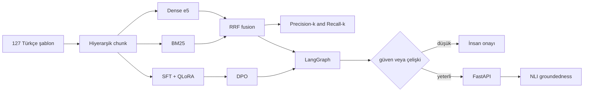

# TeknikYaz

**Türkçe teknik dokümantasyon asistanı** — hiyerarşik hibrit RAG, LangGraph çok ajanlı orkestrasyon, QLoRA/DPO, ölçülebilir retrieval ve düşük güvende insan onayı.

Taslak notları, orijinal Türkçe şablon korpusuna (README, API, kurulum, mimari…) dayandırarak düzgün belgeye çevirir. Colab/Kaggle GPU ve yerel PyTorch ile uçtan uca çalışır.

[English](#english) · [Çalıştırma günlüğü](docs/CALISTIRMA_GUNLUGU.md)

<p>
  
  
  
  
  
</p>

## Ölçülen sonuçlar

Portföy ölçeği (127 orijinal belge, 146 chunk). Amaç SOTA liderboard değil; her katmanın **gerçekten çalıştığını** ve hataların nasıl yakalandığını göstermek.

| Katman | Sonuç |
|---|---|
| Retrieval, 32 gold soru, RTX 2080 | Rerank-only **P@1 0.66** → RRF fusion sonrası **P@1 1.00 / Recall@5 1.00** |
| Türkçe sınıflandırıcı (`dbmdz/bert-base-turkish-cased`) | Accuracy **0.955**, macro F1 **0.972** (sessiz etiket hatası F1 0.32 iken yakalandı) |
| QLoRA `Qwen2.5-3B-Instruct` | Eğitilebilir parametre **%0.24**, val loss 1.84 → 1.47 |
| Yerel NF4 generate (64 token, RTX 2080) | **P95 6.4 s**, 5.8 GB VRAM |
| DistilBERT öğrenci (sınıflandırıcı) | ~**%49** daha düşük gecikme |
| XAI | Base modelde 3 tekrarlanabilir halüsinasyon; NLI groundedness **0.20** ile yakalandı |

32 soruluk gold set, web-ölçeği IR değildir. Şablon niyeti ("nasıl yazılır") başlık sinyalidir, gizli etiket sızıntısı değil. Ayrıntı: [`docs/CALISTIRMA_GUNLUGU.md`](docs/CALISTIRMA_GUNLUGU.md).

## Mimari



**Retrieval:** dense + BM25 adayları birleşir, RRF sıraları korur, cross-encoder *ek* skordur. Reranker tek hakem olunca `README Şablonu` top-5'ten düşüyordu.

**Ajanlar:** yönlendirici → retrieve → yazar → eleştirmen (çelişki + groundedness) → konsensüs → `needs_human_review`.

## Depo

```
src/agents/          LangGraph: router, conflict, consensus
src/rag/             hybrid retrieve, RRF fusion, hierarchy, eval
src/finetune/        QLoRA
src/alignment/       DPO
src/xai/             groundedness, güven, HITL eşiği
src/optimize/        quantize / prune / distill + vLLM istemcisi
src/serving/         FastAPI
src/nlp_tasks/       sınıflandırma, NER, özet, QA, çeviri, diyalog
notebooks/           Colab 00–08
data/eval/           retrieval gold (Precision@k / Recall@k)
docker/              API + isteğe bağlı vLLM GPU profili
```

## Kurulum

**Colab (önerilen, GPU):** [`notebooks/00_ortam_kurulumu.ipynb`](notebooks/00_ortam_kurulumu.ipynb) — Runtime → T4 GPU.

**Yerel testler:**

```bash
python -m venv .venv
# Windows: .venv\Scripts\activate
pip install -r requirements.txt
pytest tests/ -q
```

Retrieval skor kartı (Chroma indeksi gerekir):

```bash
python scripts/run_retrieval_eval.py
```

vLLM (ayrı GPU konteyneri; imaj büyük):

```bash
docker compose --profile gpu -f docker/docker-compose.yml up vllm
python scripts/run_vllm_bench.py
```

Notebook sırası: veri → NLP görevleri → RAG → QLoRA → DPO → inference → LLMOps → XAI.

## Dürüst sınırlar

- Öğrenim / portföy sistemi; klinik production orkestratörü değil.
- DPO, SFT’nin zaten öğrendiği “yapı vs. serbest” ekseninde küçük etki gösterdi; sonraki eksen “uydurma vs. reddet” olmalı.
- vLLM istemcisi hazır; bu makinede imaj çekimi ağ hatasıyla kesildi. P95 yukarıdaki NF4 generate ölçümü.
- Gold set 32 soru, tek ilgili belge ağırlıklı — P@5’in tavanı ~0.20.

Tüm örnek belgeler bu proje için yazıldı; kazınmış veya telifli korpus yok.

---

<a id="english"></a>

## English

End-to-end Turkish LLM stack: hierarchical hybrid RAG (dense + BM25 + RRF), LangGraph agents (route / write / critique / consensus / human gate), QLoRA + DPO on Qwen2.5-3B, FastAPI, NLI groundedness.

Measured on a 127-document original corpus: retrieval **P@1 1.00 / R@5 1.00** on a 32-query gold set after fusion (was 0.66 P@1 with rerank-only), Turkish classifier macro-F1 **0.972**, local NF4 **P95 6.4 s** on RTX 2080. Portfolio scale, not a production clinical system — failures are documented on purpose.

Author: [Beyza Nur Kılıç](https://github.com/l4NGEL)
