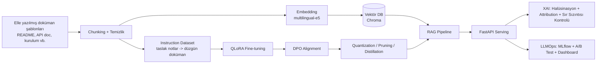

# TeknikYaz Asistanı — Türkçe Teknik Dokümantasyon Yazım Asistanı

Bu proje, büyük dil modelleri / NLP mühendisliği alanında (RAG mimarisi, LLM fine-tuning,
alignment, inference optimizasyonu, LLMOps, XAI) uçtan uca, uygulamalı bir öğrenim/portföy
projesidir: kullanıcının verdiği kaba taslak notları, iyi yazılmış Türkçe teknik
dokümantasyon örneklerinin (README, API dokümantasyonu, kurulum kılavuzu vb.) stilini ve
yapısını referans alarak düzgün, tutarlı bir dokümana dönüştüren bir asistan.

Çalışma ortamı **Google Colab / Kaggle** (ücretsiz GPU) için tasarlandı. Her aşama hem
bağımsız bir Colab notebook'u hem de `src/` altında yeniden kullanılabilir, test edilmiş
Python modülleri olarak mevcut.

## Mimari



## Kapsanan Teknik Beceriler → Proje Bileşeni Eşleşmesi

| Beceri | Bu projede nerede |
|---|---|
| Transformer tabanlı LLM eğitimi | [`src/finetune/qlora_train.py`](src/finetune/qlora_train.py), [`notebooks/04_fine_tuning_qlora.ipynb`](notebooks/04_fine_tuning_qlora.ipynb) |
| RAG mimarisi (vektör DB, embedding, belge yönetimi) | [`src/rag/`](src/rag), [`notebooks/03_rag_sistemi.ipynb`](notebooks/03_rag_sistemi.ipynb) |
| Metin sınıflandırma | [`src/nlp_tasks/classification.py`](src/nlp_tasks/classification.py) — doküman türü sınıflandırma |
| Varlık tanıma (NER) | [`src/nlp_tasks/ner.py`](src/nlp_tasks/ner.py) — kod parçası, CLI bayrağı, sürüm, dosya yolu |
| Özetleme | [`src/nlp_tasks/summarization.py`](src/nlp_tasks/summarization.py) |
| Soru-cevap | [`src/nlp_tasks/qa.py`](src/nlp_tasks/qa.py) |
| Diyalog yönetimi | [`src/nlp_tasks/dialogue.py`](src/nlp_tasks/dialogue.py) |
| Makine çevirisi | [`src/nlp_tasks/translation.py`](src/nlp_tasks/translation.py) |
| Quantization / Pruning / Distillation | [`src/optimize/`](src/optimize) |
| LLMOps (deney takibi, versiyonlama, A/B test, izleme) | [`src/llmops/`](src/llmops) |
| LoRA / QLoRA / PEFT / instruction tuning | [`src/finetune/qlora_train.py`](src/finetune/qlora_train.py) |
| RLHF / DPO / PPO (alignment) | [`src/alignment/`](src/alignment) |
| PyTorch ile eğitim/değerlendirme/dağıtım | tüm `src/` modülleri, `torch` + `transformers` |
| Docker / Kubernetes | [`docker/`](docker) |
| Git / CI-CD | [`.github/workflows/ci.yml`](.github/workflows/ci.yml) |
| Linux/bash betikleri | [`scripts/`](scripts) |
| Güvenilirlik / XAI / halüsinasyon azaltma / önyargı tespiti | [`src/xai/`](src/xai) |

## Kurulum

### Colab (önerilen)
`notebooks/00_ortam_kurulumu.ipynb` dosyasını Colab'da açıp çalıştırın; proje dosyalarını
Drive'dan alıp bağımlılıkları kurar. GPU runtime seçmeyi unutmayın (Runtime → Çalışma
zamanını değiştir → T4 GPU).

### Yerel (sadece serving/test için, GPU gerektirmez)
```bash
python -m venv .venv
source .venv/Scripts/activate  # Windows Git Bash
pip install -r requirements.txt
pytest tests/ -q
```

## Önerilen çalışma sırası

1. `01_veri_hazirlama` — Elle yazılmış doküman şablonu korpusunu chunk'lara böl, taslak
   notlar → düzgün doküman çiftlerinden oluşan instruction veri setini üret.
2. `02_nlp_gorevleri` — Sınıflandırma, NER, özetleme, çeviri, ekstraktif QA modellerini dene.
3. `03_rag_sistemi` — Embedding + Chroma + retrieval + generation ile temel RAG'ı kur.
4. `04_fine_tuning_qlora` — Taslak notlardan doküman üreten QLoRA fine-tune.
5. `05_alignment_dpo` — İyi yapılandırılmış doküman vs. serbest/tutarsız üretim ile DPO.
6. `06_inference_optimizasyon` — Quantization, pruning, distillation, benchmark.
7. `07_llmops_deney_takibi` — MLflow ile deney takibi, A/B test, model versiyonlama.
8. `08_xai_guvenilirlik` — Halüsinasyon tespiti, attribution, sır sızıntısı/güvenlik kontrolü.

Sonda `docker/` ile servisi konteynerleştirip `serving/api.py`'yi FastAPI üzerinden ayağa
kaldırabilir, `.github/workflows/ci.yml` ile CI'yi GitHub'a push ettiğinizde otomatik
çalıştırabilirsiniz.

## Neden bu domain?

Dokümantasyon yazımı, her yazılım ekibinin gerçek ve tekrar eden bir ihtiyacıdır: dağınık
notlardan tutarlı, iyi yapılandırılmış teknik metin üretmek RAG + fine-tuning + alignment
+ XAI'nin hepsinin anlamlı olduğu somut bir problemdir (özellikle "modelin var olmayan bir
özelliği/parametreyi uydurması" riski, XAI/halüsinasyon bölümüne gerçek bir gerekçe verir).
Kullanılan tüm örnek dokümanlar bu proje için orijinal olarak yazılmıştır; dışarıdan
kazınmış (scraped) ya da telif hakkı olan bir içerik kullanılmamıştır.
