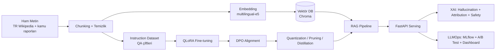

# TİHA-Asistan — Türkçe Savunma/Havacılık Teknik Doküman Asistanı

Bu proje, Baykar Doğal Dil İşleme Takımı ilanındaki **her bir yetkinliği** tek, uçtan uca
bir sistem içinde uygulamalı olarak öğretmek için tasarlandı: RAG mimarisi ile
Türkçe savunma/havacılık dokümanlarını sorgulayan, fine-tune edilmiş ve hizalanmış
(aligned), optimize edilmiş, izlenebilir (LLMOps) ve açıklanabilir (XAI) bir LLM asistanı.

Çalışma ortamı **Google Colab / Kaggle** (ücretsiz GPU) için tasarlandı. Her aşama hem
bağımsız bir Colab notebook'u hem de `src/` altında yeniden kullanılabilir, test edilmiş
Python modülleri olarak mevcut.

## Mimari



## İlan Maddesi → Proje Bileşeni Eşleşmesi

| İlandaki yetkinlik | Bu projede nerede |
|---|---|
| Transformer tabanlı LLM eğitimi | [`src/finetune/qlora_train.py`](src/finetune/qlora_train.py), [`notebooks/04_fine_tuning_qlora.ipynb`](notebooks/04_fine_tuning_qlora.ipynb) |
| RAG mimarisi (vektör DB, embedding, belge yönetimi) | [`src/rag/`](src/rag), [`notebooks/03_rag_sistemi.ipynb`](notebooks/03_rag_sistemi.ipynb) |
| Metin sınıflandırma | [`src/nlp_tasks/classification.py`](src/nlp_tasks/classification.py) |
| Varlık tanıma (NER) | [`src/nlp_tasks/ner.py`](src/nlp_tasks/ner.py) |
| Özetleme | [`src/nlp_tasks/summarization.py`](src/nlp_tasks/summarization.py) |
| Soru-cevap | [`src/nlp_tasks/qa.py`](src/nlp_tasks/qa.py) |
| Diyalog yönetimi | [`src/nlp_tasks/dialogue.py`](src/nlp_tasks/dialogue.py) |
| Makine çevirisi | [`src/nlp_tasks/translation.py`](src/nlp_tasks/translation.py) |
| Quantization / Pruning / Distillation | [`src/optimize/`](src/optimize) |
| LLMOps (deney takibi, versiyonlama, A/B test, izleme) | [`src/llmops/`](src/llmops) |
| LoRA / QLoRA / PEFT / instruction tuning | [`src/finetune/qlora_train.py`](src/finetune/qlora_train.py) |
| RLHF / DPO / PPO (alignment) | [`src/alignment/`](src/alignment) |
| PyTorch ile eğitim/değerlendirme/dağıtım | tüm `src/` modülleri, `torch` + `transformers` |
| Docker / Kubernetes | [`docker/`](docker) |
| Git / CI-CD | [`.github/workflows/ci.yml`](.github/workflows/ci.yml) |
| Linux/bash betikleri | [`scripts/`](scripts) |
| Güvenilirlik / XAI / halüsinasyon azaltma / önyargı tespiti | [`src/xai/`](src/xai) |

## Kurulum

### Colab (önerilen)
`notebooks/00_ortam_kurulumu.ipynb` dosyasını Colab'da açıp çalıştırın; repo'yu klonlayıp
bağımlılıkları kurar. GPU runtime seçmeyi unutmayın (Runtime → Change runtime type → T4 GPU).

### Yerel (sadece serving/test için, GPU gerektirmez)
```bash
python -m venv .venv
source .venv/Scripts/activate  # Windows Git Bash
pip install -r requirements.txt
pytest tests/ -q
```

## Önerilen çalışma sırası

1. `01_veri_hazirlama` — Türkçe savunma/havacılık korpusunu topla, temizle, chunk'la.
2. `02_nlp_gorevleri` — Sınıflandırma, NER, özetleme, çeviri, ekstraktif QA modellerini dene.
3. `03_rag_sistemi` — Embedding + Chroma + retrieval + generation ile temel RAG'ı kur.
4. `04_fine_tuning_qlora` — RAG'dan üretilen instruction dataset ile QLoRA fine-tune.
5. `05_alignment_dpo` — Gerekçeli/kaynaklı cevap vs. halüsinasyonlu cevap ile DPO.
6. `06_inference_optimizasyon` — Quantization, pruning, distillation, benchmark.
7. `07_llmops_deney_takibi` — MLflow ile deney takibi, A/B test, model versiyonlama.
8. `08_xai_guvenilirlik` — Halüsinasyon tespiti, attribution, güvenlik/önyargı kontrolü.

Sonda `docker/` ile servisi konteynerleştirip `serving/api.py`'yi FastAPI üzerinden ayağa
kaldırabilir, `.github/workflows/ci.yml` ile CI'yi GitHub'a push ettiğinizde otomatik
çalıştırabilirsiniz.

## Neden bu domain?

Baykar'ın çalışma alanına (İHA, savunma sanayii) doğrudan atıfta bulunan, kamuya açık
Türkçe Wikipedia makaleleri ve genel savunma sanayii terminolojisi üzerine kurulu bir
korpus kullanıyoruz — mülakatta "neden bu projeyi yaptım" sorusuna doğal bir cevap.
Hiçbir gizli/özel Baykar verisi kullanılmaz.
